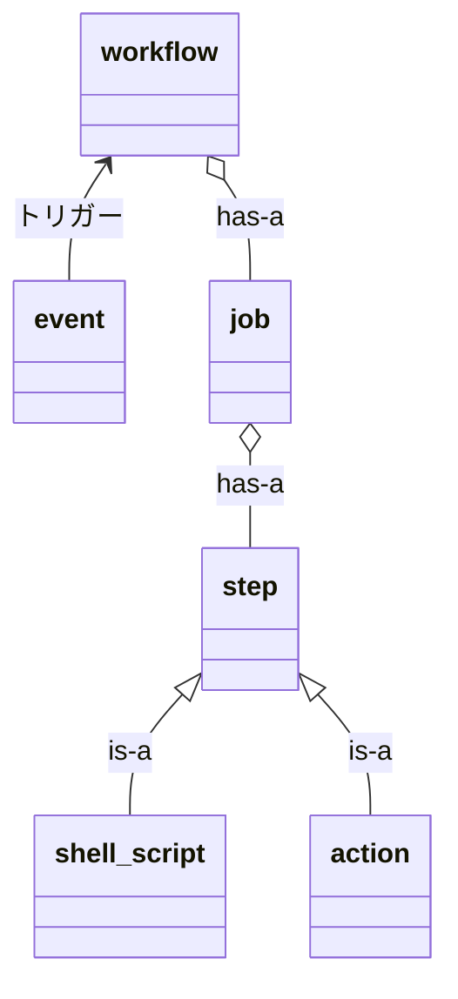

## GitHub Actionsの概要

GitHub Actionsは、テスト・ビルド・デプロイなどを自動化するためのプラットフォームです。GitHub Actionsの実行環境（ランナー）はLinux・Windows・MacOSから選択できます。

## GitHub Actionsの用語

| 用語     | 意味                                                                               |
| -------- | ---------------------------------------------------------------------------------- |
| workflow | イベントが起きたときに実行する一連の処理。                                         |
| event    | ワークフローをトリガーする、GitHub上で起きるイベント。                             |
| job      | ワークフローを構成する処理のまとまり。並列または直列に実行可能。                   |
| step     | ジョブを構成する1つの1つの処理。シェルスクリプトまたは再利用可能なactionを使える。 |
| runner   | ジョブが実行されるサーバー。                                                 |

図で整理すると以下のような感じです。



## ワークフローを作成するときに考慮する性質

ワークフローを作成する上で考慮するのは、ジョブの以下の性質です。

1. ジョブには依存関係が定義でき、依存関係によって実行順序が決まる。依存関係を定義しない場合は並列に実行される。
2. 異なるジョブは異なるランナー（サーバー）で実行される。そのため、データを共有したい場合はGitHubにファイルを保存するアクションを使う必要がある。

### ジョブには依存関係が定義できる

あるジョブは、そのジョブが依存しているすべてのジョブが正常に終了したあとに実行されます。

例えば、ジョブ1←ジョブ2、ジョブ1←ジョブ3のように依存関係を定義した場合、以下の画像の左から右の順に実行されます。


ジョブに依存関係を定義するためには、`jobs.<job_id>.needs`を使います。

```yaml
name: learn-job-dependency
on: [push]
jobs:
  job1:
    runs-on: ubuntu-20.04
    steps:
      - run: echo 'Hello, job1'
  job2:
    runs-on: ubuntu-20.04
    needs: job1
    steps:
      - run: echo 'Hello, job2'
  job3:
    runs-on: ubuntu-20.04
    needs: job1
    steps:
      - run: echo 'Hello, job3'
```

### 異なるジョブは異なるランナーで実行される

異なるジョブは異なるランナーで実行されるため、データを共有するためには工夫が必要になります。

データを共有する1つの方法は、artifacts（成果物）を使う方法です。artifactsとはGitHub ActionsでGitHubに保存できるファイル群のことです。artifactsはデフォルトでは90日間保存されます。

まず、共有が上手くいかない例を以下に示します。依存関係を定義して順番に実行されるようにしているものの、実行されるランナーが別のため、前のジョブで作成したファイルにはアクセスできません。

```yaml
name: learn-sharing-data-between-jobs
on: [push]
jobs:
  output:
    runs-on: ubuntu-20.04
    steps:
      - run: expr 1 + 1 > output.log
      - run: ls -l
  use-output:
    runs-on: ubuntu-20.04
    needs: output
    steps:
      - run: ls -l # ファイルは存在しない
```


次に、artifactを使った正しい方法です。

```yaml
name: learn-sharing-data-between-jobs
on: [push]
jobs:
  upload-file:
    runs-on: ubuntu-20.04
    steps:
      - run: expr 1 + 1 > output.log
      - uses: actions/upload-artifact@v3
        with:
          name: output-log
          path: output.log
  download-file:
    runs-on: ubuntu-20.04
    needs: upload-file
    steps:
      - uses: actions/download-artifact@v3
        with:
          name: output-log
      - run: cat output.log
```


GitHubにアップロードしてからダウンロードしているため共有できています。ジョブ間でデータを共有する他の方法には、`set-output`コマンドを使う方法があるようです。

[GitHub Actionsのワークフローコマンド - GitHub Docs](https://docs.github.com/ja/actions/using-workflows/workflow-commands-for-github-actions)

## 参考

- [Understanding GitHub Actions - GitHub Docs](https://docs.github.com/ja/actions/learn-github-actions/understanding-github-actions)
    - GitHub Actionsの概要、用語の定義
- [Using jobs in a workflow - GitHub Docs](https://docs.github.com/ja/actions/using-jobs/using-jobs-in-a-workflow)
    - ジョブの依存関係について
- [GitHub Actions の重要な機能 - GitHub Docs](https://docs.github.com/ja/actions/learn-github-actions/essential-features-of-github-actions#sharing-data-between-jobs)
    - ジョブ間のデータの共有について